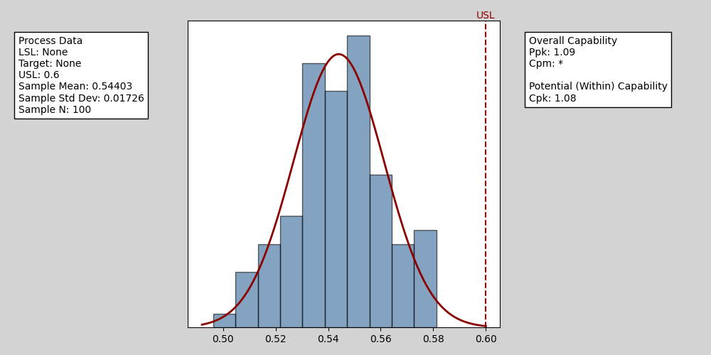

Emulating minitab plots

Yes, the code was helped a lot with ChatGPT. Thanks!

## Demo chart



## Usage

```python
import pyminitab as pym
pym.hist(
    data: np.ndarray, LSL: float = None, USL: float = None, title: str = "", nbins=None
)
```
